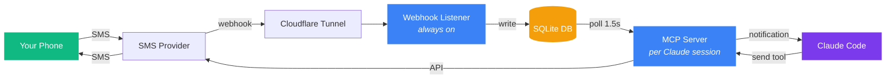
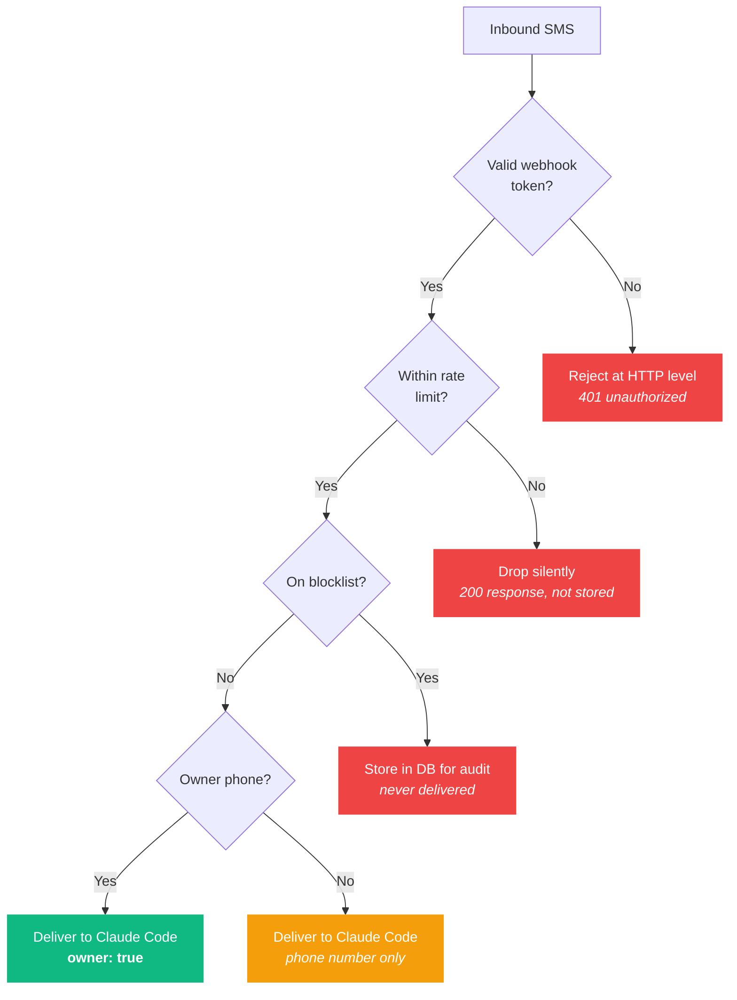
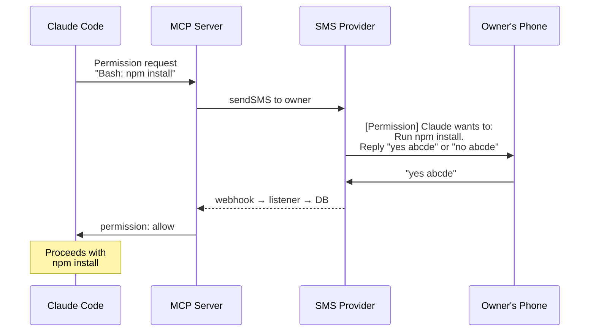

<p align="center">
  
  
  
</p>

# claude-code-sms

**Give Claude Code a phone number.** People text it, Claude reads it. Claude replies, they get a text.

A [Claude Code channel plugin](https://docs.anthropic.com/en/docs/claude-code) that bridges SMS/MMS into your coding session. The owner gets full trust and can approve tool calls from their phone. Anyone else can text in too — their messages are delivered to Claude but treated as untrusted, and Claude decides what to do with them. Blocked numbers are silently dropped.

---

## How It Works



The plugin has two components that share a single SQLite database:

**Webhook Listener** (`listener.ts`) — A lightweight HTTP server that runs 24/7 as a systemd (or launchd) service. When someone sends an SMS to your number, the provider fires a webhook. The listener validates it, downloads any MMS media, and writes the message to SQLite. It runs independently of Claude Code so that messages are never lost — most providers fire webhooks once with no retry.

**MCP Server** (`server.ts`) — Spawned automatically by Claude Code as a subprocess over stdio. Every 1.5 seconds it polls SQLite for new inbound messages and delivers them to Claude Code as channel notifications. It also exposes tools for Claude to send SMS/MMS and retrieve conversation history.

### Multiple Claude Code Sessions

Multiple Claude Code sessions can run on the same machine, each with its own MCP server instance. The database tracks delivery per-session — so if two sessions are running, both will see the same inbound SMS independently.

Each MCP server registers a session on startup with a **stable ID**, derived in this order of precedence:

1. `SMS_SESSION_ID` — explicit operator override
2. `CLAUDE_SESSION_ID` — if Claude Code injects one, its SHA-1 prefix is used
3. Auto-derived from the state directory + subscribed DIDs (deterministic hash)

Stable IDs mean a restart of the same logical consumer resumes where it left off instead of re-reading the full history. A `deliveries` table records which messages each session has already seen, using a high-water mark for efficient polling. When a session shuts down, it's marked inactive. Stale sessions are automatically cleaned up after 7 days.

**First-ever registration** of a session ID bootstraps the high-water mark to the tip of the message log by default, so a brand-new subscriber doesn't get flooded with backfill. Set `SMS_REPLAY_ON_FIRST_START=full` to opt into full historical replay for a new subscriber instead.

Sessions can optionally subscribe to specific phone numbers (DIDs) by setting `SMS_SUBSCRIBE_DIDS` in the environment — useful if you have multiple provider accounts and want each Claude Code session to handle different numbers.

---

## Trust Model

Every inbound message passes through a multi-layer gate before it reaches Claude Code:



| | Owner | Everyone else | Blocked |
|---|---|---|---|
| **Configured in** | `OWNER_PHONE` in `.env` | (no list — default) | `blockList` in `access.json` |
| **Messages delivered?** | Yes, with `owner: "true"` in meta | Yes, with E.164 phone number only | No — stored in DB for audit, never delivered |
| **Can approve/deny tool calls?** | Yes | No | No |
| **Claude trusts instructions?** | Yes — full trust | No — Claude should treat the sender as untrusted and decide whether to respond, ignore, or escalate to the owner | N/A |

There is no inbound allowlist — any non-blocked number reaches Claude, and the model decides how to handle it. If you want to keep specific numbers out, add them to the blocklist. The blocklist supports glob-style wildcards on E.164 phone numbers (e.g. `+1900*` blocks all premium-rate numbers).

Outbound sends are always allowed — the model can text any number.

---

## Providers

The plugin is provider-agnostic. Set `SMS_PROVIDER` in your `.env` file to choose which one to use. There are two ways to connect a provider:

### Dedicated providers

These have their own implementation with **cryptographic webhook signature validation** — the strongest security for inbound webhooks. Covers ~55% of the global CPaaS market.

| Provider | `SMS_PROVIDER` | Signature | Status |
|----------|---------------|-----------|--------|
| [Twilio](https://www.twilio.com) | `twilio` | HMAC-SHA1 | Untested |
| [Vonage](https://www.vonage.com) | `vonage` | HMAC-SHA256 | Untested |
| [Telnyx](https://telnyx.com) | `telnyx` | ed25519 | Untested |
| [Plivo](https://www.plivo.com) | `plivo` | HMAC-SHA256 V3 | Untested |
| [MessageBird / Bird](https://bird.com) | `messagebird` | HMAC-SHA256 JWT | Untested |
| [Sinch](https://www.sinch.com) | `sinch` | HMAC-SHA256 | Untested |

### Generic provider (`SMS_PROVIDER=other`)

A **config-driven provider** that works with any REST-based SMS service. Instead of writing code, you describe your provider's API shape in a JSON config file. Uses token-based webhook authentication (shared secret in the URL or header). Covers the remaining ~35% of the market.

Set `SMS_PROVIDER=other` and create `~/.claude/channels/sms/other-provider.json` (see `other-provider.example.json` for the format). Pick a type preset that matches your provider's API pattern:

| Type | Auth | Body format | Best for |
|------|------|-------------|----------|
| `basic_json` | HTTP Basic | JSON | Bandwidth, ClickSend, BulkSMS, Burst SMS |
| `bearer_json` | Bearer token | JSON | Sinch, Telnyx, and similar |
| `apikey_json` | API key header | JSON | Infobip, MessageBird, Kaleyra, Textmagic |
| `basic_form` | HTTP Basic | Form-encoded | Twilio-like providers |
| `query_get` | Query params | Query params | voip.ms and similar legacy APIs |
| `custom` | Manual | Manual | Anything else |

### Known working configurations

These providers have been tested or documented for use with the generic provider:

| Provider | Type | Tested? |
|----------|------|---------|
| [voip.ms](https://voip.ms) | `query_get` | **Yes** |
| [Bandwidth](https://www.bandwidth.com) | `basic_json` | No |
| [ClickSend](https://www.clicksend.com) | `basic_json` | No |
| [BulkSMS](https://www.bulksms.com) | `basic_json` | No |
| [Burst SMS](https://www.transmitsms.com) | `basic_json` | No |
| [Infobip](https://www.infobip.com) | `apikey_json` | No |
| [Textmagic](https://www.textmagic.com) | `apikey_json` | No |
| [Kaleyra](https://www.kaleyra.com) | `apikey_json` | No |

The dedicated providers (Twilio, Vonage, etc.) can also be used via the generic provider if you prefer simplicity over signature validation — just use `SMS_PROVIDER=other` with the appropriate type preset.

**Got a working config for a provider not listed here?** We want to grow this table. Open a [GitHub issue](https://github.com/mattstein111/claude-code-sms/issues) or PR with your `other-provider.json` config (redact credentials) and we'll add it to the known configurations.

Want to add a dedicated provider with signature validation? See [Contributing a Provider](#contributing-a-provider).

---

## Quick Start

### 1. Clone and install

```bash
git clone https://github.com/mattstein111/claude-code-sms.git
cd claude-code-sms
bun install
```

> **Important — Bun PATH:** Claude Code spawns the MCP server in a non-interactive shell. If your `bun` PATH export is below the non-interactive guard in `~/.bashrc` (the `case $- in *i*) ;; *) return;; esac` pattern), `bun` won't be found and the server will silently fail to start. Make sure the Bun PATH export is in `~/.profile` or `~/.bash_profile`, or above the guard in `~/.bashrc`. On macOS with zsh this is typically not an issue.

### 2. Register the plugin with Claude Code

The plugin must be registered as a marketplace and installed before Claude Code will load it. From inside the cloned directory:

```bash
# Add the local repo as a plugin marketplace
claude plugin marketplace add .

# Install the plugin (user scope = available in all sessions)
claude plugin install sms
```

**Restart Claude Code after installing.** The plugin's skills (`/sms:configure`, `/sms:access`) and MCP tools won't appear until the next session.

### 3. Configure

The fastest path is the built-in skill — run `/sms:configure` inside a Claude Code session and it will walk you through everything interactively. (This requires the plugin to be installed per step 2.)

To configure manually, first create the state directory:

```bash
mkdir -p ~/.claude/channels/sms && chmod 700 ~/.claude/channels/sms
```

Then create `~/.claude/channels/sms/.env` with your provider credentials. Every setup needs these common variables:

```env
SMS_PROVIDER=twilio              # see Providers section for options
OWNER_PHONE=+14165551234         # your personal phone number in E.164 — gets full trust
SMS_WEBHOOK_TOKEN=<random>       # secret for validating inbound webhooks (openssl rand -hex 24)
SMS_WEBHOOK_PATH=/incoming       # URL path the webhook listener accepts — obscure in production
LISTEN_PORT=5090                 # port the webhook listener binds to
```

Then add the provider-specific variables (see [Provider Configuration](#provider-configuration) below).

Finally, set the file permissions:

```bash
chmod 600 ~/.claude/channels/sms/.env
```

### 4. Set up access control

An `access.json` file is optional — the defaults (DM policy enabled, empty blocklist) work out of the box. Create `~/.claude/channels/sms/access.json` only if you want to customize:

```json
{
  "dmPolicy": "enabled",
  "blockList": ["+1900*"],
  "textChunkLimit": 160,
  "chunkMode": "length"
}
```

- `dmPolicy` — `"enabled"` (default) delivers all non-blocked inbound to Claude; `"disabled"` drops everything
- `blockList` — numbers silently blocked (stored for audit, never delivered)
- `textChunkLimit` / `chunkMode` — legacy. Only consulted when a provider's long-message strategy is `"chunk"` (see "Long messages" below). Most providers handle long messages natively.

The owner phone (from `.env`) always reaches Claude with full trust unless it's on the blocklist.

### 5. Start the webhook listener

The listener must be running to receive inbound SMS. You can run it directly for testing:

```bash
bun run listener
```

For production, install it as a systemd user service (Linux):

```bash
cp systemd/sms-listener.service ~/.config/systemd/user/
# Edit the service file to match your Bun path and project directory
systemctl --user daemon-reload
systemctl --user enable --now sms-listener
```

### 6. Expose the listener to the internet

Your SMS provider needs to reach the webhook listener. Set up a tunnel (Cloudflare Tunnel, ngrok, etc.) pointing to `localhost:5090` (or whatever `LISTEN_PORT` you configured).

### 7. Configure your provider's webhook

In your SMS provider's portal, set the inbound message webhook URL to:

```
https://your-tunnel.com/<SMS_WEBHOOK_PATH>?token=<SMS_WEBHOOK_TOKEN>
```

The exact location of this setting varies by provider — see the provider-specific notes in [Provider Configuration](#provider-configuration).

### 8. Use it

Start a new Claude Code session (any directory — the plugin is installed globally). Send a text to your number and Claude will see it as a channel notification. You can also run `/sms:configure` to verify the setup or `/sms:access` to manage the blocklist and DM policy.

---

## Provider Configuration

Each provider requires its own set of environment variables in addition to the common ones. Click to expand:

### Dedicated providers

<details>
<summary><strong>Twilio</strong></summary>

```env
TWILIO_ACCOUNT_SID=ACxxxxxxxxxxxxxxxxxxxxxxxxxxxxxxxx
TWILIO_AUTH_TOKEN=your_auth_token
TWILIO_PHONE_NUMBER=+14165551234
```

**Webhook setup:** In the Twilio console, go to your phone number's configuration. Under Messaging, set the "A MESSAGE COMES IN" webhook URL.

**Notes:** Twilio validates inbound webhooks with an `X-Twilio-Signature` header (HMAC-SHA1). The plugin verifies this automatically. Twilio supports up to 10 media URLs per MMS.
</details>

<details>
<summary><strong>Vonage / Nexmo</strong></summary>

```env
VONAGE_API_KEY=your_api_key
VONAGE_API_SECRET=your_api_secret
VONAGE_PHONE_NUMBER=+14165551234
VONAGE_SIGNATURE_SECRET=optional          # for webhook signature validation
```

**Webhook setup:** In the Vonage dashboard, navigate to Numbers > Your number and set the Inbound Webhook URL.

**Notes:** Uses the SMS API for plain text messages and the Messages API for MMS. Multi-image MMS sends each image as a separate API call.
</details>

<details>
<summary><strong>Telnyx</strong></summary>

```env
TELNYX_API_KEY=KEYxxxxxxxxxxxxxxxxxxxxxxxx
TELNYX_PHONE_NUMBER=+14165551234
TELNYX_PUBLIC_KEY=optional                # ed25519 webhook verification
TELNYX_MESSAGING_PROFILE_ID=optional
```

**Webhook setup:** In the Telnyx Mission Control Portal, configure the messaging webhook URL for your number or messaging profile.

**Notes:** Uses bearer token authentication. Native MMS support with a `media_urls` array in the API.
</details>

<details>
<summary><strong>Plivo</strong></summary>

```env
PLIVO_AUTH_ID=your_auth_id
PLIVO_AUTH_TOKEN=your_auth_token
PLIVO_PHONE_NUMBER=+14165551234
PLIVO_SIGNATURE_V3_TOKEN=optional         # V3 webhook validation
```

**Webhook setup:** In the Plivo console, go to Messaging > Applications and set the Message URL.

**Notes:** Uses HTTP Basic authentication. Phone numbers are sent without the `+` prefix in the Plivo API (the plugin handles this conversion internally).
</details>

<details>
<summary><strong>MessageBird / Bird</strong></summary>

```env
MESSAGEBIRD_ACCESS_KEY=your_access_key
MESSAGEBIRD_PHONE_NUMBER=+14165551234
MESSAGEBIRD_SIGNING_KEY=optional          # for JWT webhook signature validation
```

**Webhook setup:** In the MessageBird dashboard, go to Developers > API Settings and configure the webhook URL for inbound messages.

**Notes:** Uses an AccessKey header for API authentication. Webhooks are signed with an HMAC-SHA256 JWT in the `MessageBird-Signature-JWT` header when a signing key is configured. Supports both SMS and MMS.
</details>

<details>
<summary><strong>Sinch</strong></summary>

```env
SINCH_SERVICE_PLAN_ID=your_service_plan_id
SINCH_API_TOKEN=your_api_token
SINCH_PHONE_NUMBER=+14165551234
SINCH_REGION=us                           # optional, default: us
SINCH_WEBHOOK_SECRET=optional             # for HMAC-SHA256 webhook validation
```

**Webhook setup:** In the Sinch dashboard, configure the callback URL for your service plan under SMS > APIs.

**Notes:** Uses bearer token authentication. The API region defaults to `us` but can be set to `eu`, `au`, etc. Webhooks are optionally signed with HMAC-SHA256 when a webhook secret is configured.
</details>

### Generic provider

<details>
<summary><strong>Generic / Other</strong> (<code>SMS_PROVIDER=other</code>)</summary>

The generic provider uses a JSON configuration file instead of environment variables for API shape. You still need the common env vars (`OWNER_PHONE`, `SMS_WEBHOOK_TOKEN`, etc.) plus any credentials referenced in your config.

1. Copy `other-provider.example.json` to `~/.claude/channels/sms/other-provider.json`
2. Edit the config to match your provider's API
3. Set any referenced env vars (credentials) in your `.env`

**Example — voip.ms via generic provider:**

```json
{
  "type": "query_get",
  "name": "voipms",
  "from_number": "+14165551234",
  "send": {
    "url": "https://voip.ms/api/v1/rest.php",
    "body": {
      "api_username": "{{env.VOIPMS_USER}}",
      "api_password": "{{env.VOIPMS_API_PASSWORD}}",
      "method": "sendSMS",
      "did": "{{from}}",
      "dst": "{{to}}",
      "message": "{{message}}"
    },
    "response_id_path": "sms",
    "phone_format": "digits"
  },
  "webhook": {
    "fields": {
      "from": "from",
      "to": "to",
      "message": "message",
      "message_id": "id",
      "media_urls": "media"
    }
  }
}
```

With `.env`:
```env
SMS_PROVIDER=other
VOIPMS_USER=user@example.com
VOIPMS_API_PASSWORD=your_api_password
```

**Template variables:** `{{to}}`, `{{from}}`, `{{message}}` for message fields; `{{env.VAR_NAME}}` for environment variables.

**Phone formats:** `e164` (+14165551234), `digits` (14165551234), `national` (4165551234).

See `other-provider.example.json` for the full schema with all options.
</details>

---

## Tools

Claude Code gets three tools from this plugin:

### `send`

Send an SMS or MMS message to a phone number. Outbound sends are always allowed. How long messages are handled depends on the provider's `longMessage.strategy` — see [Long messages](#long-messages).

| Parameter | Type | Required | Description |
|-----------|------|----------|-------------|
| `chat_id` | string | yes | Recipient phone number in E.164 format (`+1XXXXXXXXXX`) |
| `text` | string | yes | Message body |
| `media_urls` | string[] | no | Publicly accessible URLs for MMS attachments (max varies by provider, typically 3, max 1300KB each) |

### `fetch_messages`

Retrieve conversation history with a specific phone number. Returns messages in chronological order (oldest first). Includes both inbound and outbound messages so Claude can reconstruct the full thread.

| Parameter | Type | Required | Description |
|-----------|------|----------|-------------|
| `phone` | string | yes | Phone number in E.164 format |
| `limit` | number | no | Maximum messages to return (default 30) |

### `download_attachment`

Get local file paths for MMS media that was downloaded when the message arrived. Returns the file path and filename for each attachment.

| Parameter | Type | Required | Description |
|-----------|------|----------|-------------|
| `message_id` | string | yes | Message ID from the database |

---

## Permission Relay

The owner can approve or deny Claude Code tool calls remotely via text message. This works through the Claude Code channel permission system:



The MCP server intercepts inbound messages from the owner that match the pattern `yes <code>` or `no <code>` (where the code is the 5-character ID from the permission request). These are consumed by the permission system and not delivered as regular messages.

Only the owner phone number can approve or deny permissions. If anyone else sends `yes abcde`, it's treated as a normal message.

---

## Skills

| Skill | Description |
|-------|-------------|
| `/sms:configure` | Interactive setup — walks you through choosing a provider, entering credentials, and setting the webhook token |
| `/sms:access` | Manage the blocklist and DM policy |

`/sms:access` subcommands:

| Subcommand | Description |
|------------|-------------|
| `list` | Show current DM policy and blocklist |
| `block <phone>` | Add a number or pattern to the blocklist |
| `remove <phone>` | Remove a number from the blocklist |
| `policy <enabled\|disabled>` | Set the DM policy |

---

## Rate Limiting & Retention

### Rate Limiting

The webhook listener enforces per-phone-number rate limits **in memory, before writing anything to the database**. This prevents a malicious or misbehaving number from flooding the database with messages.

| Setting | Env var | Default |
|---------|---------|---------|
| Messages per minute per number | `RATE_LIMIT_PER_MINUTE` | 10 |
| Messages per hour per number | `RATE_LIMIT_PER_HOUR` | 100 |

Rate-limited messages are silently dropped with a 200 response (so the provider doesn't retry). The rate limiter uses an in-memory sliding window — zero disk I/O, and it resets when the listener restarts.

### Message Retention

Both inbound and outbound messages are stored in the database so that Claude Code can always reconstruct the full conversation with any counterparty. To prevent unbounded growth, the listener runs a retention purge on startup and every 24 hours:

| Setting | Env var | Default |
|---------|---------|---------|
| Max messages kept per counterparty | `RETENTION_MAX_PER_PHONE` | 1000 |
| Max age for any message | `RETENTION_MAX_DAYS` | 180 days |
| Max age for blocked messages | `RETENTION_BLOCKED_DAYS` | 3 days |

Set any value to `0` to disable that particular rule.

The purge also cleans up stale session data: sessions that haven't polled in over an hour are marked inactive, and dead sessions (along with their delivery records) are removed after 7 days.

---

## Database Schema

The SQLite database has three tables:

**`messages`** — Append-only log of all SMS traffic. The webhook listener writes inbound messages; the MCP server writes outbound messages. No delivery state is stored here.

| Column | Description |
|--------|-------------|
| `id` | Auto-incrementing primary key |
| `timestamp` | ISO 8601 timestamp |
| `direction` | `"in"` or `"out"` |
| `phone` | Counterparty phone number (E.164) |
| `did` | Local phone number that sent/received (E.164) |
| `message` | Message text |
| `media` | Comma-separated local file paths for MMS attachments |
| `provider_msg_id` | Provider-specific message ID (used for deduplication) |
| `blocked` | `1` if blocklisted, `0` otherwise |

**`sessions`** — One row per MCP server instance. Tracks which DIDs the session subscribes to and its high-water mark for efficient polling.

**`deliveries`** — Per-session, per-message delivery tracking. When an MCP server delivers a message to Claude Code, it records the `(session_id, message_id)` pair here. This is what enables multiple Claude Code sessions to independently see the same inbound messages.

---

## Data Directory

All runtime state lives under `~/.claude/channels/sms/`:

```
~/.claude/channels/sms/
├── .env                     # Provider credentials and config (chmod 600)
├── access.json              # DM policy, blocklist, and chunking settings (optional)
├── other-provider.json      # Generic provider config (when SMS_PROVIDER=other)
├── sms.db                   # SQLite database (messages, sessions, deliveries)
├── media/                   # Downloaded MMS attachments
└── logs/
    └── listener.log         # Webhook listener log (JSON lines, one entry per line)
```

---

## Contributing a Provider

The provider interface (`providers/interface.ts`) is intentionally small — typically 50-100 lines per implementation:

```typescript
interface SmsProvider {
  name: string
  webhookMethod: "GET" | "POST" | "GET|POST"
  validateConfig(): void
  getFromNumber(): string
  sendSMS(to: string, message: string): Promise<SendResult>
  sendMMS(to: string, message: string, mediaUrls: string[]): Promise<SendResult>
  parseWebhook(req: Request): Promise<InboundMessage | null>
  fetchMedia(providerMessageId: string): Promise<string[]>
}
```

To add a new provider:

1. Create `providers/<name>.ts` implementing `SmsProvider`
2. Import and register it in `providers/index.ts`
3. Document the required env vars in the README and the `/sms:configure` skill

Phone numbers arrive as E.164 (`+14165551234`). Your provider module converts to whatever format the API expects (e.g., Plivo strips the `+`, Twilio uses E.164 as-is).

> **Note:** Before writing a dedicated provider, check whether the generic provider (`SMS_PROVIDER=other`) can handle your use case. Dedicated providers are only needed when the provider has a bespoke webhook signature scheme that can't be expressed as simple token validation.

### Sharing a generic provider config

If you've tested a generic provider configuration that works, please contribute it back so others don't have to figure it out from scratch:

1. **Open an issue** with the provider name, the `type` preset you used, and your `other-provider.json` (with credentials redacted)
2. **Or submit a PR** adding the provider to the "Known working configurations" table above, optionally with an example config in the docs

Even a "confirmed working" update for an existing entry in the table is valuable — most are currently marked "No" under Tested.

---

## Troubleshooting

<details>
<summary><strong>MCP server silently fails to start</strong></summary>

Claude Code spawns the MCP server in a non-interactive shell. If `bun` isn't on the PATH in that context, the server fails with no visible error.

**Check:** Run `bash -c 'which bun'` (note: not an interactive shell). If it prints nothing, your Bun PATH export is below the non-interactive guard in `~/.bashrc`.

**Fix:** Move the Bun PATH export to `~/.profile` or `~/.bash_profile`, or above the `case $- in *i*) ;; *) return;; esac` guard in `~/.bashrc`. Then start a new Claude Code session.
</details>

<details>
<summary><strong>Skills don't appear after <code>claude plugin install</code></strong></summary>

The plugin's skills (`/sms:configure`, `/sms:access`) and MCP tools are only loaded at session startup. After installing or updating the plugin, fully restart Claude Code.
</details>

<details>
<summary><strong><code>claude plugin install sms</code> can't find the plugin</strong></summary>

The plugin must be registered as a marketplace first:

```bash
cd /path/to/claude-code-sms
claude plugin marketplace add .
claude plugin install sms
```

Run `claude plugin marketplace list` to verify the marketplace was added.
</details>

---

## Known Limitations

- **Claude Code channels are a research preview** (launched March 2026). There are known upstream bugs where notifications can be silently dropped when the session is idle, or duplicate plugin instances can be spawned. These are Claude Code issues, not plugin bugs.
- **Webhook reliability** — if the listener process is down when a provider fires a webhook, that message is lost. Most providers do not retry. The systemd service with auto-restart mitigates this.
- **Outbound MMS** requires that media URLs are publicly accessible on the internet — the SMS provider fetches the media from the URL you provide. This plugin does not host or proxy files.
- **Long messages** — see [Long messages](#long-messages) below.
- **Dedicated providers** (Twilio, Vonage, Telnyx, Plivo, MessageBird, Sinch) are implemented based on API documentation but have not been tested with live accounts. The generic provider has been tested with voip.ms. See [GitHub issues](https://github.com/mattstein111/claude-code-sms/issues) for testing status.

---

## Long messages

A single SMS segment holds ~160 GSM-7 chars (70 UCS-2). Messages that exceed this are handled per the provider's `longMessage.strategy`:

| Strategy | When | What it does | Who uses it |
|---|---|---|---|
| `passthrough` | Provider's SMS API handles multipart SMS natively (proper UDH concatenation, recipient reassembles) | Full body passed to sendSMS in one call | Twilio, Telnyx, Plivo, Sinch, MessageBird, Vonage, most modern APIs — this is the default for the generic `other` provider |
| `mms_fallback` | Provider caps sendSMS at 160 chars with no concatenation, but has a separate MMS API that accepts longer text | Messages `> threshold` are sent via the provider's MMS endpoint as text-only MMS (up to ~1600 chars) | voip.ms |
| `chunk` | Last resort; provider supports neither long SMS nor text-only MMS | DIY-splits the body at `threshold` and sends each slice as an independent SMS. **Recipients will see fragmented, potentially reordered messages.** | None of the built-in providers |

Built-in providers declare their strategy in the `SmsProvider` object. The generic `other` provider reads from the config file:

```json
{
  "long_message_strategy": "mms_fallback",
  "long_message_threshold": 160,
  "mms": {
    "body": { "method": "sendMMS" }
  }
}
```

When `long_message_strategy` is `mms_fallback`, the `mms` block shallow-merges onto `send` before firing — useful when the same endpoint handles both SMS and MMS and only a field or two differ (voip.ms flips `body.method`).

MMS with actual media attachments always goes through `sendMMS` regardless of strategy.

---

## License

Private. Not yet licensed for distribution.
