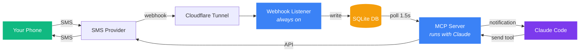
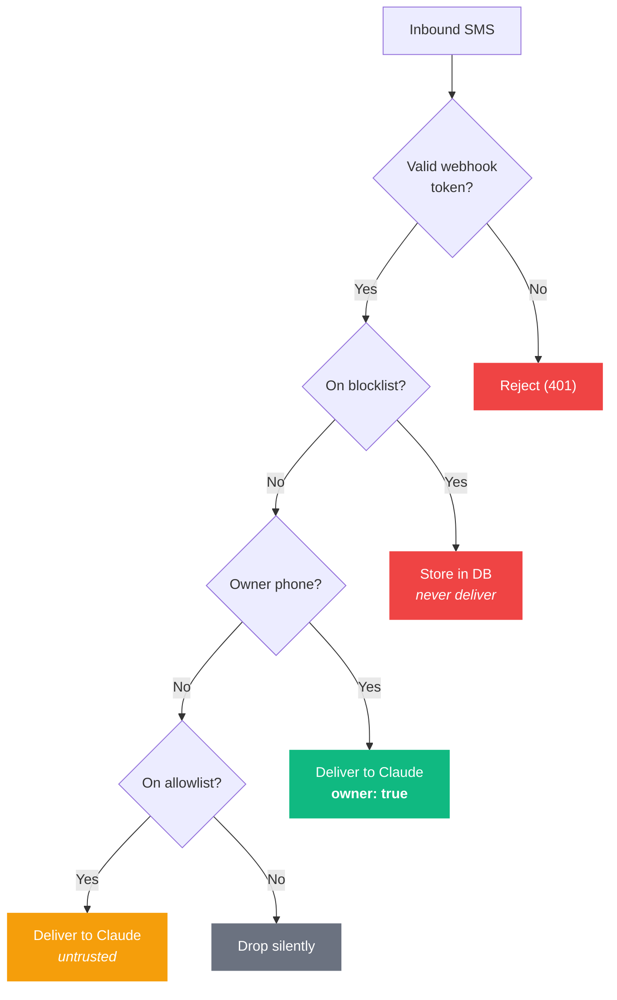
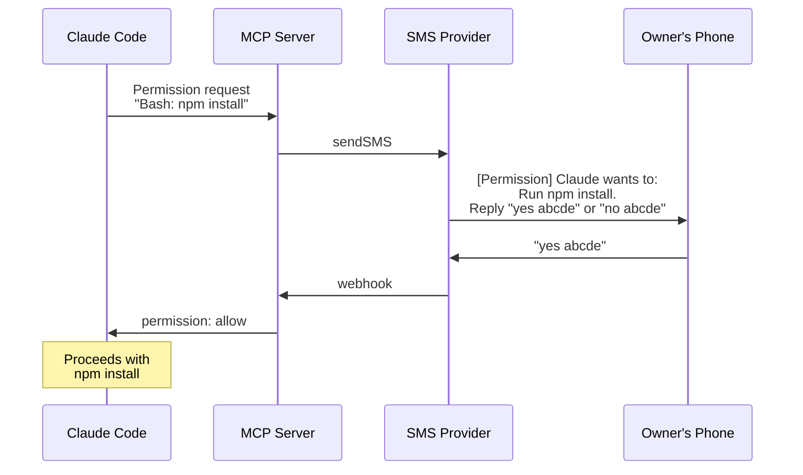

<p align="center">
  
  
  
</p>

# claude-code-sms

**Give Claude Code a phone number.** People text it, Claude reads it. Claude replies, they get a text. That simple.

A [Claude Code channel plugin](https://docs.anthropic.com/en/docs/claude-code) that bridges SMS/MMS into your coding session — with a trust model, access control, and remote permission relay so you can approve tool calls from your phone.

---

## How It Works



Two processes, one shared database:

| Component | Role | Lifecycle |
|-----------|------|-----------|
| **Webhook Listener** | Catches inbound SMS/MMS, stores in SQLite | Always on (systemd / launchd) |
| **MCP Server** | Polls DB, notifies Claude Code, sends replies | One per Claude Code session |

**Why two processes?** Most SMS providers fire webhooks once with no retry. The listener runs 24/7 so nothing is lost — MCP servers catch up when Claude Code starts.

**Multi-instance safe.** Multiple Claude Code sessions on the same machine each get their own MCP server instance. Each independently tracks which messages it has delivered — so two sessions both see the same inbound SMS. Sessions can subscribe to specific DIDs via `SMS_SUBSCRIBE_DIDS` to partition by phone number.

---

## Trust Model



| | Owner | Allowlisted | Blocked |
|---|---|---|---|
| **Configured in** | `OWNER_PHONE` in `.env` | `allowFrom` in `access.json` | `blockList` in `access.json` |
| **Messages delivered?** | Yes, with `owner: "true"` flag | Yes, no special flags | No (stored for audit only) |
| **Can approve permissions?** | Yes | No | No |
| **Claude trusts instructions?** | Yes | No — requires owner approval | N/A |

Wildcards supported: `+1416*` matches all Toronto 416 numbers.

---

## Rate Limiting & Retention

### Rate Limiting

The webhook listener enforces per-phone-number rate limits **in memory, before any DB write**. This prevents flooding attacks from exhausting disk space or polluting the database.

| Setting | Env var | Default |
|---------|---------|---------|
| Messages per minute per number | `RATE_LIMIT_PER_MINUTE` | 10 |
| Messages per hour per number | `RATE_LIMIT_PER_HOUR` | 100 |

Rate-limited messages are silently dropped (200 response so the provider doesn't retry). The rate limiter uses a sliding window with zero disk I/O.

### Message Retention

The database keeps a conversation window per counterparty so Claude Code can always reconstitute a thread:

| Setting | Env var | Default |
|---------|---------|---------|
| Max messages per counterparty | `RETENTION_MAX_PER_PHONE` | 1000 |
| Max age for all messages | `RETENTION_MAX_DAYS` | 180 days |
| Max age for blocked messages | `RETENTION_BLOCKED_DAYS` | 3 days |

- Both inbound and outbound messages are stored so full conversation context is available
- Undelivered messages (not yet seen by Claude Code) are **never purged**
- Purge runs on listener startup and every 24 hours
- Set any value to `0` to disable that purge rule

---

## Providers

Bring your own phone number from any of these providers:

| Provider | `SMS_PROVIDER` value | Status |
|----------|---------------------|--------|
| [voip.ms](https://voip.ms) | `voipms` | **Tested** |
| [Twilio](https://www.twilio.com) | `twilio` | Untested |
| [Vonage](https://www.vonage.com) | `vonage` | Untested |
| [Telnyx](https://telnyx.com) | `telnyx` | Untested |
| [Plivo](https://www.plivo.com) | `plivo` | Untested |

Adding a provider? See [Contributing a Provider](#contributing-a-provider) below.

---

## Quick Start

### 1. Clone and install

```bash
git clone https://github.com/mattstein111/claude-code-sms.git
cd claude-code-sms
bun install
```

### 2. Configure

The easiest way is the built-in skill — run `/sms:configure` inside Claude Code. It walks you through everything.

Or do it manually:

```bash
mkdir -p ~/.claude/channels/sms && chmod 700 ~/.claude/channels/sms
```

Create `~/.claude/channels/sms/.env` (chmod 600):

```env
SMS_PROVIDER=voipms           # or twilio, vonage, telnyx, plivo
OWNER_PHONE=+14165551234      # your phone — gets full trust
SMS_WEBHOOK_TOKEN=<random>    # openssl rand -hex 24
SMS_WEBHOOK_PATH=/incoming    # obscure this in production
LISTEN_PORT=5090

# ... plus provider-specific vars (see Provider Configuration below)
```

Create `~/.claude/channels/sms/access.json`:

```json
{
  "dmPolicy": "allowlist",
  "allowFrom": [],
  "blockList": [],
  "textChunkLimit": 160,
  "chunkMode": "length"
}
```

### 3. Start the webhook listener

```bash
# Quick test
bun run listener

# Production (Linux)
cp systemd/sms-listener.service ~/.config/systemd/user/
systemctl --user enable --now sms-listener
```

Point a Cloudflare tunnel (or ngrok, etc.) at `localhost:5090`.

### 4. Configure your provider's webhook

In your provider's portal, set the inbound message webhook URL to:
```
https://your-tunnel.com/<SMS_WEBHOOK_PATH>?token=<SMS_WEBHOOK_TOKEN>
```

### 5. Use it

The plugin auto-registers when Claude Code runs in this directory. Send a text to your number — Claude will see it.

---

## Provider Configuration

Each provider needs its own env vars alongside the common ones above.

<details>
<summary><strong>voip.ms</strong> (tested)</summary>

```env
VOIPMS_USER=user@example.com
VOIPMS_API_PASSWORD=your_api_password    # API password, not account password
VOIPMS_DID=6474837416                    # your DID, 10-11 digits
```

**Webhook:** DID Numbers > Manage DID > Edit > SMS/MMS > URL Callback

**Notes:** Uses GET webhooks (unusual). API password is set separately in the voip.ms portal under DIDS > DID Numbers > Manage DID > Edit DID.
</details>

<details>
<summary><strong>Twilio</strong> (untested)</summary>

```env
TWILIO_ACCOUNT_SID=ACxxxxxxxxxxxxxxxxxxxxxxxxxxxxxxxx
TWILIO_AUTH_TOKEN=your_auth_token
TWILIO_PHONE_NUMBER=+14165551234
```

**Webhook:** Phone number > Messaging > "A MESSAGE COMES IN" URL

**Notes:** Validates inbound webhooks via `X-Twilio-Signature` (HMAC-SHA1). Supports up to 10 media URLs per MMS.
</details>

<details>
<summary><strong>Vonage / Nexmo</strong> (untested)</summary>

```env
VONAGE_API_KEY=your_api_key
VONAGE_API_SECRET=your_api_secret
VONAGE_PHONE_NUMBER=+14165551234
VONAGE_SIGNATURE_SECRET=optional          # for webhook signature validation
```

**Webhook:** Dashboard > Numbers > Your number > Inbound Webhook URL

**Notes:** Uses SMS API for text, Messages API for MMS. Multi-image MMS sends each image as a separate message.
</details>

<details>
<summary><strong>Telnyx</strong> (untested)</summary>

```env
TELNYX_API_KEY=KEYxxxxxxxxxxxxxxxxxxxxxxxx
TELNYX_PHONE_NUMBER=+14165551234
TELNYX_PUBLIC_KEY=optional                # ed25519 webhook verification
TELNYX_MESSAGING_PROFILE_ID=optional
```

**Webhook:** Mission Control > Messaging > Number/Profile > Inbound Webhook

**Notes:** Bearer token auth. Native MMS support with `media_urls` array.
</details>

<details>
<summary><strong>Plivo</strong> (untested)</summary>

```env
PLIVO_AUTH_ID=your_auth_id
PLIVO_AUTH_TOKEN=your_auth_token
PLIVO_PHONE_NUMBER=+14165551234
PLIVO_SIGNATURE_V3_TOKEN=optional         # V3 webhook validation
```

**Webhook:** Console > Messaging > Applications > Message URL

**Notes:** Basic auth. Phone numbers sent without `+` prefix internally.
</details>

---

## Tools

Claude Code gets three tools from this plugin:

### `send`
Send an SMS or MMS.

```
chat_id:    "+14165551234"           # required — E.164 phone number
text:       "Build passed!"          # required — message body
media_urls: ["https://..."]          # optional — public URLs, max 1300KB each
```

### `fetch_messages`
Pull conversation history.

```
phone:  "+14165551234"               # required — E.164 phone number
limit:  30                           # optional — default 30, oldest first
```

### `download_attachment`
Get local file paths for MMS media.

```
message_id: "42"                     # required — DB message ID
```

---

## Permission Relay

Approve or deny Claude Code tool calls from your phone:



Only the owner phone can approve permissions. Replies from other numbers are silently ignored.

---

## Skills

| Skill | Description |
|-------|-------------|
| `/sms:configure` | Interactive setup — provider, credentials, webhook, access control |
| `/sms:access` | Manage allowlist, blocklist, and pairing approvals |

`/sms:access` subcommands: `list`, `allow <phone>`, `block <phone>`, `remove <phone>`, `policy <allowlist\|disabled>`, `pair <code>`

---

## Data Directory

Everything lives under `~/.claude/channels/sms/`:

```
~/.claude/channels/sms/
├── .env              # Credentials (chmod 600)
├── access.json       # Allowlist + blocklist
├── sms.db            # SQLite message history
├── media/            # Downloaded MMS attachments
├── approved/         # Pairing approval markers
└── logs/
    └── listener.log  # Webhook listener log (JSON lines)
```

---

## Contributing a Provider

The provider interface (`providers/interface.ts`) is intentionally small:

```typescript
interface SmsProvider {
  name: string
  webhookMethod: "GET" | "POST" | "GET|POST"
  validateConfig(): void
  sendSMS(to: string, message: string): Promise<SendResult>
  sendMMS(to: string, message: string, mediaUrls: string[]): Promise<SendResult>
  parseWebhook(req: Request): Promise<InboundMessage | null>
  fetchMedia(providerMessageId: string): Promise<string[]>
}
```

To add a provider:

1. Create `providers/<name>.ts` — typically 50-100 lines
2. Register it in `providers/index.ts`
3. Document the required env vars

Phone numbers arrive as E.164 (`+14165551234`). Your provider converts to whatever format its API needs internally.

---

## Known Limitations

- **Claude Code channels are a research preview** (March 2026). Notification delivery has known bugs.
- **Webhook reliability** — if the listener is down when a webhook fires, that message is lost. Most providers don't retry.
- **Outbound MMS** requires publicly accessible media URLs. The plugin doesn't host files.
- **Long messages** are chunked at 160 characters by default (configurable via `textChunkLimit`).
- **Twilio, Vonage, Telnyx, and Plivo** providers are implemented but untested — see [GitHub issues](https://github.com/mattstein111/claude-code-sms/issues) for status.

---

## License

Private. Not yet licensed for distribution.
